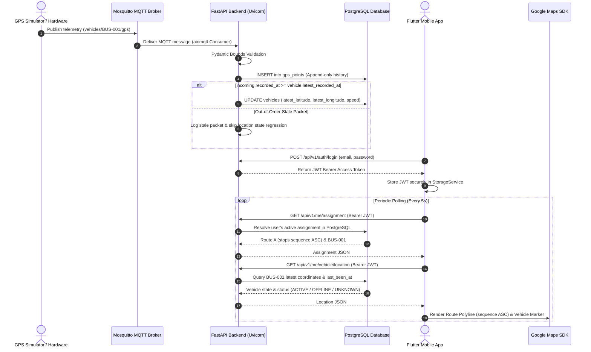

# GPS Vehicle Tracking System - Master Run & Debug Guide

This document provides exact, step-by-step instructions for running, testing, demonstrating, and troubleshooting the **GPS Vehicle Tracking System** across all components (**PostgreSQL**, **Mosquitto MQTT**, **FastAPI Backend**, **GPS Simulator**, and **Flutter Mobile Application**).

---

## 1. System Topology & Flow Architecture



---

## 2. Development Demo Credentials

Use these pre-seeded development credentials for testing and demonstration:

| User Role | Email | Password | Assigned Route | Assigned Vehicle |
| :--- | :--- | :--- | :--- | :--- |
| **Driver User A** | `driver_a@example.com` | `Password123!` | Route A ("Main Campus Loop") | `BUS-001` |
| **Driver User B** | `driver_b@example.com` | `Password123!` | Route B ("Express South Route") | `BUS-002` |

---

## 3. Step-by-Step System Execution Guide

### Step 1: Environment Setup
Copy `.env.example` to `backend/.env`:
```bash
cp .env.example backend/.env
```

### Step 2: Launch Docker Infrastructure (Recommended Deployment)
Spin up PostgreSQL, Mosquitto MQTT, FastAPI, and GPS Simulator containers:
```bash
docker-compose up --build -d
```

Verify service status:
```bash
docker-compose ps
```

Expected healthy output:
- `gps_postgres`: `Up (healthy)` on port `5432`
- `gps_mosquitto`: `Up (healthy)` on port `1883`
- `gps_backend`: `Up (healthy)` on port `8000`
- `gps_simulator`: `Up` streaming telemetry

---

### Step 3: Local Bare-Metal Backend Setup (Alternative Execution)
If running without Docker:
```bash
# 1. Navigate to backend directory
cd backend

# 2. Create virtual environment & install dependencies
python -m venv .venv
.\.venv\Scripts\activate   # Windows (source .venv/bin/activate on Linux/Mac)
pip install -r requirements.txt

# 3. Apply database migrations
alembic upgrade head

# 4. Seed initial database data
python -m app.db.seed

# 5. Start Uvicorn development server
uvicorn app.main:app --reload --host 0.0.0.0 --port 8000
```

---

### Step 4: Verify FastAPI Endpoints
1. **Health Check**:
   ```bash
   curl http://localhost:8000/api/v1/health
   ```
   *Expected Response (`200 OK`)*:
   ```json
   {"status": "ok", "version": "1.0.0", "timestamp": "2026-09-07T12:00:00Z"}
   ```

2. **User A Login**:
   ```bash
   curl -X POST http://localhost:8000/api/v1/auth/login \
     -H "Content-Type: application/json" \
     -d '{"email": "driver_a@example.com", "password": "Password123!"}'
   ```
   *Expected Response (`200 OK`)*: Returns JSON with `access_token`.

3. **User A Active Assignment**:
   ```bash
   curl http://localhost:8000/api/v1/me/assignment \
     -H "Authorization: Bearer <TOKEN>"
   ```
   *Expected Response (`200 OK`)*: Returns Route A stops sorted by `sequence ASC` and vehicle `BUS-001`.

---

### Step 5: Execute Automated Full-System Flow Verifier
Run the automated end-to-end flow test:
```bash
python scripts/verify_full_system.py
```
*Expected Output*: PASS on all 7 flow gates (Health, Login, Assignment, Vehicle, Live MQTT, Stale Packet Protection, Keyset History).

---

### Step 6: Launch Flutter Mobile Application

#### API Base URL Configuration (`lib/main.dart`):
- **Android Emulator**: Set `baseUrl` to `http://10.0.2.2:8000` (bridges emulator to host machine localhost).
- **iOS Simulator / Desktop**: Set `baseUrl` to `http://localhost:8000`.
- **Physical Device**: Set `baseUrl` to host machine LAN IP (e.g., `http://192.168.1.50:8000`).

#### Google Maps API Key Setup:
Ensure your Google Maps API key is configured in `frontend/android/app/src/main/AndroidManifest.xml`:
```xml
<meta-data
    android:name="com.google.android.geo.API_KEY"
    android:value="YOUR_GOOGLE_MAPS_API_KEY_HERE"/>
```

#### Launch App:
```bash
cd frontend
flutter pub get
flutter run
```

---

## 4. Demonstrating Key Features & Security

### 1. User A Demonstration
1. Launch Flutter app and enter `driver_a@example.com` / `Password123!`.
2. Tap **Login**. Verify token is saved and app navigates to `TrackingScreen`.
3. Verify top header displays **Route A** ("Main Campus Loop") and assigned vehicle **BUS-001**.
4. Verify Google Maps displays:
   - Polyline connecting Route A waypoints in `sequence ASC` order.
   - Vehicle marker for **BUS-001** positioned at backend-provided GPS coordinates.
5. Watch the vehicle marker update every 5 seconds as the simulator publishes new coordinates.

### 2. User B Demonstration
1. Tap **Logout** on `TrackingScreen`. Verify token is purged and app returns to `LoginScreen`.
2. Enter `driver_b@example.com` / `Password123!`. Tap **Login**.
3. Verify screen displays **Route B** ("Express South Route") and assigned vehicle **BUS-002**. User A's vehicle is completely hidden.

### 3. Server-Side Security & Cross-User Authorization Test
1. Log in as **User B** (`driver_b@example.com`).
2. Attempt to query User A's vehicle (`BUS-001` UUID) directly:
   ```bash
   curl http://localhost:8000/api/v1/vehicles/<BUS-001-UUID> \
     -H "Authorization: Bearer <USER_B_TOKEN>"
   ```
3. *Expected Result*: `HTTP 403 Forbidden` (`VEHICLE_ACCESS_DENIED`).
4. **Explanation**: The FastAPI backend enforces server-side authorization scoping, rejecting cross-user vehicle data access attempts.

---

## 5. Comprehensive Debugging & Troubleshooting Guide

| Failure Scenario | Where to Inspect | Command / Action | Expected Result | Root Cause & Resolution |
| :--- | :--- | :--- | :--- | :--- |
| **Flutter cannot reach FastAPI** | Mobile client network connection | `curl http://10.0.2.2:8000/api/v1/health` inside emulator shell | HTTP 200 OK | Android Emulator cannot resolve `localhost`. Update `ApiService.baseUrl` to `http://10.0.2.2:8000`. |
| **FastAPI cannot reach PostgreSQL** | Backend DB connection pool | `docker-compose logs backend` or check `DATABASE_URL` | DB connection established | PostgreSQL service down or invalid credentials in `.env`. Ensure `postgres` service is healthy. |
| **FastAPI cannot reach MQTT** | Mosquitto broker task | `docker-compose logs backend` | "Successfully connected to MQTT broker" | Mosquitto service not listening on port 1883. Ensure `mosquitto` container is running. |
| **MQTT messages not arriving** | Simulator publication logs | `docker-compose logs simulator` | `[PUBLISHED] Topic: vehicles/BUS-001/gps` | Topic mismatch or broker disconnection. Verify topic format matches `vehicles/{vehicle_code}/gps`. |
| **GPS History not stored** | Database `gps_points` table | `docker-compose exec postgres psql -U postgres -d gps_tracker -c "SELECT COUNT(*) FROM gps_points;"` | Row count > 0 | Telemetry bounds validation failed (`lat` outside `[-90, 90]` or negative speed). Check backend logs for `INVALID_TELEMETRY_PACKET`. |
| **Latest location not updating** | Out-of-order telemetry engine | `docker-compose logs backend \| grep "Out-of-order"` | "Out-of-order telemetry: appended to history, location state preserved" | Telemetry `timestamp` is older than `vehicle.latest_recorded_at`. This is correct stale packet protection behavior. |
| **Google Maps does not render** | Android Manifest API Key | `flutter logs` or check Android logcat | Map tiles load smoothly | Missing or invalid Google Maps API key in `AndroidManifest.xml`. Configure valid Google Maps API Key. |
| **Vehicle marker does not move** | Polling timer & location API | Check Flutter debug console for `getVehicleLocation()` calls | HTTP 200 with updated lat/lon | Vehicle telemetry simulator paused or vehicle status `OFFLINE`. Ensure simulator is running. |
| **JWT / Session fails** | Token expiration check | Inspect `POST /api/v1/auth/login` token `exp` claim | Fresh JWT token issued | Token timestamp exceeded 60 minutes. Re-authenticate on `LoginScreen`. |
| **User sees wrong vehicle** | Server-side active assignment | `GET /api/v1/me/assignment` | Assignment matching user's database record | Incorrect token passed or multiple active assignments. Ensure partial unique index `idx_unique_active_user` is applied. |
