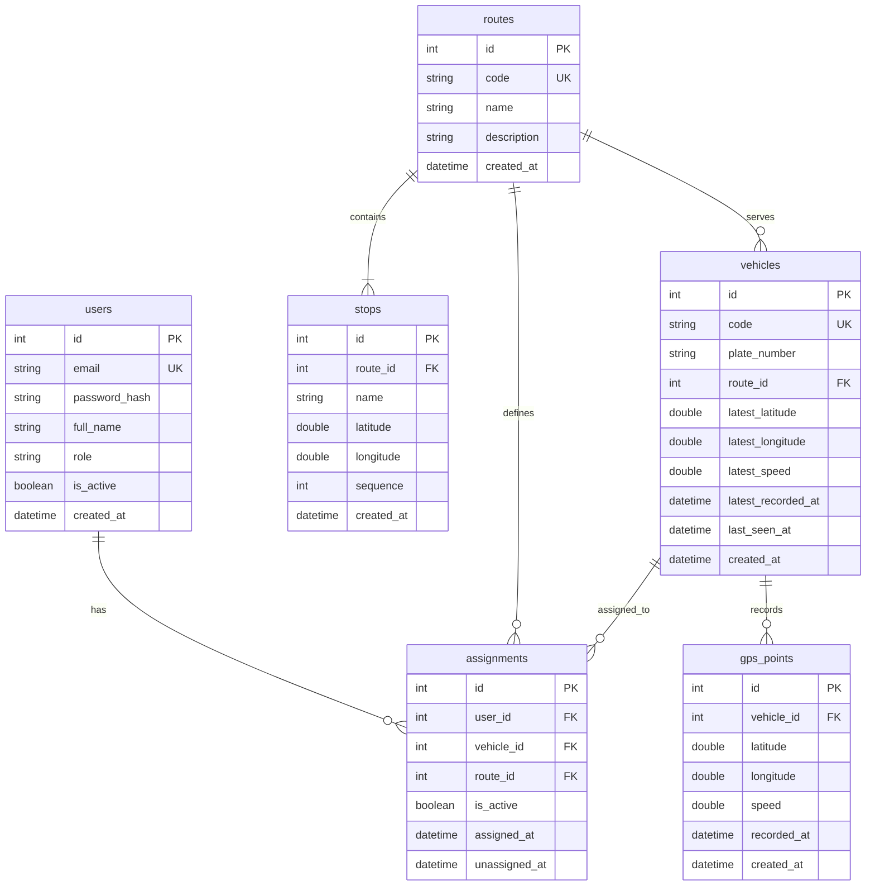

# Database Architecture & Schema Specification

## 1. Entity-Relationship Diagram



---

## 2. Table Specifications & Indexes

### 2.1 `users`
Stores system accounts for drivers and administrative users.
- `id`: `INTEGER PRIMARY KEY GENERATED BY DEFAULT AS IDENTITY`
- `email`: `VARCHAR(255) UNIQUE NOT NULL`
- `password_hash`: `VARCHAR(255) NOT NULL` (Bcrypt)
- `full_name`: `VARCHAR(255) NOT NULL`
- `role`: `VARCHAR(50) NOT NULL DEFAULT 'driver'`
- `is_active`: `BOOLEAN NOT NULL DEFAULT TRUE`
- `created_at`: `TIMESTAMPTZ NOT NULL DEFAULT NOW()`

---

### 2.2 `routes`
Defines transit routes in the system.
- `id`: `INTEGER PRIMARY KEY GENERATED BY DEFAULT AS IDENTITY`
- `code`: `VARCHAR(50) UNIQUE NOT NULL`
- `name`: `VARCHAR(255) NOT NULL`
- `description`: `TEXT`
- `created_at`: `TIMESTAMPTZ NOT NULL DEFAULT NOW()`

---

### 2.3 `stops`
Ordered waypoints along a route for polyline rendering.
- `id`: `INTEGER PRIMARY KEY GENERATED BY DEFAULT AS IDENTITY`
- `route_id`: `INTEGER NOT NULL REFERENCES routes(id) ON DELETE CASCADE`
- `name`: `VARCHAR(255) NOT NULL`
- `latitude`: `DOUBLE PRECISION NOT NULL`
- `longitude`: `DOUBLE PRECISION NOT NULL`
- `sequence`: `INTEGER NOT NULL`
- `created_at`: `TIMESTAMPTZ NOT NULL DEFAULT NOW()`
- **Indexes**:
  - `idx_stops_route_sequence` ON `stops(route_id, sequence)`

---

### 2.4 `vehicles`
Vehicle metadata and current real-time state.
- `id`: `INTEGER PRIMARY KEY GENERATED BY DEFAULT AS IDENTITY`
- `code`: `VARCHAR(50) UNIQUE NOT NULL`
- `plate_number`: `VARCHAR(50) NOT NULL`
- `route_id`: `INTEGER NOT NULL REFERENCES routes(id)`
- `latest_latitude`: `DOUBLE PRECISION`
- `latest_longitude`: `DOUBLE PRECISION`
- `latest_speed`: `DOUBLE PRECISION`
- `latest_recorded_at`: `TIMESTAMPTZ`
- `last_seen_at`: `TIMESTAMPTZ`
- `created_at`: `TIMESTAMPTZ NOT NULL DEFAULT NOW()`

---

### 2.5 `assignments`
Historical and active user-to-vehicle/route mappings.
- `id`: `INTEGER PRIMARY KEY GENERATED BY DEFAULT AS IDENTITY`
- `user_id`: `INTEGER NOT NULL REFERENCES users(id)`
- `vehicle_id`: `INTEGER NOT NULL REFERENCES vehicles(id)`
- `route_id`: `INTEGER NOT NULL REFERENCES routes(id)`
- `is_active`: `BOOLEAN NOT NULL DEFAULT TRUE`
- `assigned_at`: `TIMESTAMPTZ NOT NULL DEFAULT NOW()`
- `unassigned_at`: `TIMESTAMPTZ`

#### Partial Unique Index Invariant:
To guarantee at most one active assignment per user in PostgreSQL while preserving full assignment history:
```sql
CREATE UNIQUE INDEX idx_unique_active_user ON assignments(user_id) WHERE is_active = TRUE;
```

---

### 2.6 `gps_points`
Append-only historical GPS telemetry records.
- `id`: `INTEGER PRIMARY KEY GENERATED BY DEFAULT AS IDENTITY`
- `vehicle_id`: `INTEGER NOT NULL REFERENCES vehicles(id) ON DELETE CASCADE`
- `latitude`: `DOUBLE PRECISION NOT NULL`
- `longitude`: `DOUBLE PRECISION NOT NULL`
- `speed`: `DOUBLE PRECISION NOT NULL`
- `recorded_at`: `TIMESTAMPTZ NOT NULL`
- `created_at`: `TIMESTAMPTZ NOT NULL DEFAULT NOW()`

#### Composite Keyset Pagination Index:
Optimizes $O(\log N)$ range and keyset cursor queries ordered by `recorded_at DESC, id DESC`:
```sql
CREATE INDEX idx_gps_points_keyset ON gps_points(vehicle_id, recorded_at DESC, id DESC);
```

---

## 3. Deterministic Development Seed Data

Executing [`python -m app.db.seed`](file:///c:/Users/Asus/Downloads/GPS-finder-/backend/scripts/seed.py) creates standard development entities:

| Entity | Code / Email | Attributes |
| :--- | :--- | :--- |
| **User A** | `driver_a@example.com` | Password: `Password123!`, Role: `driver` |
| **User B** | `driver_b@example.com` | Password: `Password123!`, Role: `driver` |
| **Route A** | `ROUTE-A` | "Main Campus Loop" (6 sequential stops) |
| **Route B** | `ROUTE-B` | "Express South Route" (6 sequential stops) |
| **Vehicle 1** | `BUS-001` | Mapped to Route A |
| **Vehicle 2** | `BUS-002` | Mapped to Route B |
| **Assignment 1** | User A $\rightarrow$ `BUS-001` | Active (`is_active = TRUE`) |
| **Assignment 2** | User B $\rightarrow$ `BUS-002` | Active (`is_active = TRUE`) |
