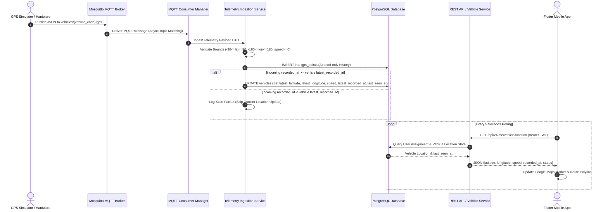

# Telemetry & GPS Flow Specification

## 1. End-to-End Telemetry Pipeline



---

## 2. Telemetry Ingestion & Validation Engine

### 2.1 MQTT Topic Pattern
Vehicle telemetry is published to topic pattern:
```text
vehicles/{vehicle_code}/gps
```
Example: `vehicles/BUS-001/gps`

### 2.2 Telemetry Payload Schema
```json
{
  "latitude": 27.700769,
  "longitude": 85.300140,
  "speed": 32.5,
  "timestamp": "2026-09-07T12:00:00Z"
}
```

### 2.3 Structural Bounds Validation (`TelemetryPayload` Pydantic DTO)
Before processing, every packet is validated against structural bounds:
- `latitude`: `-90.0 <= latitude <= 90.0`
- `longitude`: `-180.0 <= longitude <= 180.0`
- `speed`: `speed >= 0.0` (in km/h)
- `timestamp`: Valid ISO 8601 string parsed into UTC `datetime`.

Packets violating these bounds are rejected immediately with log code `INVALID_TELEMETRY_PACKET` without corrupting the database.

---

## 3. Out-of-Order Stale Packet Protection Engine

In mobile networks, cellular latency or offline buffer flushes can cause older telemetry packets to arrive after newer packets.

### Invariant Rules:
1. **History Preservation**: **EVERY** valid telemetry packet is inserted into the append-only `gps_points` table to preserve accurate historical breadcrumbs.
2. **Current Position Protection**: The vehicle's current location state (`latest_latitude`, `latest_longitude`, `latest_speed`, `latest_recorded_at`) is updated **ONLY IF**:
   $$\text{incoming.recorded\_at} \ge \text{vehicle.latest\_recorded\_at}$$

### Code Implementation ([`TelemetryIngestionService`](file:///c:/Users/Asus/Downloads/GPS-finder-/backend/app/services/telemetry_ingestion_service.py)):
```python
# 1. Always record in historical table
await self.gps_repository.create(
    vehicle_id=vehicle.id,
    latitude=payload.latitude,
    longitude=payload.longitude,
    speed=payload.speed,
    recorded_at=payload.timestamp,
)

# 2. Update current location only if timestamp is fresh
if vehicle.latest_recorded_at is None or payload.timestamp >= vehicle.latest_recorded_at:
    await self.vehicle_repository.update_location(
        vehicle_id=vehicle.id,
        latitude=payload.latitude,
        longitude=payload.longitude,
        speed=payload.speed,
        recorded_at=payload.timestamp,
        last_seen_at=now,
    )
else:
    logger.info(f"Out-of-order packet ignored for current state update on {vehicle_code}.")
```

---

## 4. Dynamic Vehicle Online Status Calculation

Vehicle status is calculated dynamically based on `last_seen_at` relative to `ONLINE_THRESHOLD_SECONDS` (default: 60s):

$$\text{Status} = \begin{cases} \text{UNKNOWN} & \text{if } \text{last\_seen\_at is NULL} \\ \text{ACTIVE} & \text{if } (\text{now} - \text{last\_seen\_at}) \le 60\text{s} \\ \text{OFFLINE} & \text{if } (\text{now} - \text{last\_seen\_at}) > 60\text{s} \end{cases}$$

---

## 5. Keyset Paginated History Queries

The history endpoint `/api/v1/me/vehicle/history` supports composite keyset cursor pagination based on `(recorded_at DESC, id DESC)`.

### Advantages over Offset Pagination:
- $O(\log N)$ index lookup performance via `idx_gps_points_keyset`.
- Prevents missing or duplicate items when new telemetry points are inserted while paginating.
